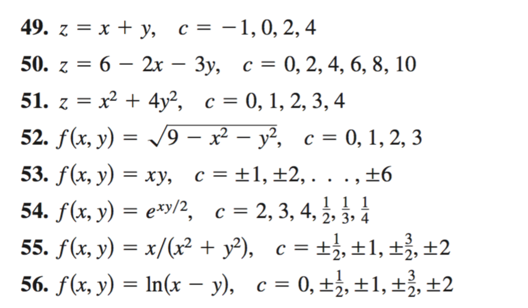

```{r setup, include=FALSE}
knitr::opts_chunk$set(echo = TRUE)
```

## Gráficos de funciones bidimiensionales

Los gráficos permiten mostrar múltiples características en una función. Los máximos, mínimos, etc., son métricas que nos dicen mucho acerca del comportamiento de una función. `R` nos permite graficar funciones de manera sencilla utilizando el concepto de vector. Por ejemplo quizás estemos interesados en conocer la forma de onda de la función seno acotada, la cual se define matemáticamente mediante la siguiente fórmula:

$$
f(t) = \begin{cases}
\sin(2 \pi t) & \mbox{para} -1 < t < 1\\
0 & \mbox{resto}.
\end{cases}
$$
Y la cual en `R` se graficaría de la siguiente manera:

```{r eval=TRUE}

t  <- seq(-1, 1, length=100)
ft   <- sin(2*pi*t)           # Se calcula la función seno a partir de t
plot(t, ft, type="l", xlim=c(-4,4), ylim=c(-1.5,1.5))
grid()

```

`R` permite añadir gráficos o puntos mediante las funciones `lines()` y `points()`. El siguiente código ejemplifica lo amterior.

```{r eval=T}
t  <- seq(-3,3, length=200)
f1 <- sin(2*pi*(t))
f2 <- sin(2*pi*(t-1/4))
f3 <- sin(2*pi*(t-1/2))
plot(t,f1, type= "l")
grid()
lines(t,f2, col="red")
points(t,f3,col="blue")


```

De igual manera se pueden definir funciones por tramos con el comando `ifelse()`, por ejemplo grafiquemos la siguiente función:

$$
f(t) = \begin{cases}
2+t & \; -2<t<-1\\
1   & \; -1<t<1\\
2-t & \;1<t<2\\
0  & \; \mbox{resto}
\end{cases}
$$

```{r eval=T}
t <- seq(-3,3, length=100)
ft <- ifelse(t> -2 & t < -1, 2+t, ifelse(t>= -1 & t <= 1, 1, ifelse(t>1 & t< 2, 2-t, 0)))
plot(t, ft, type = "l")
grid()
```

### Ejercicios:


Graficar las siguientes funciones:

$$
f(t) = \begin{cases}
1 & \; t>0\\
0 & \; \mbox{resto}
\end{cases}
$$

$$
f(t) = \begin{cases}
1+t & \; -1<t<0\\
1-t & \; 0 \le t<1\\
0 & \; \mbox{resto}
\end{cases}
$$

$$
f(t) = \begin{cases}
\mbox{e}^{-2t} & \; 0<t<2\\
1+t & \;  -1<t<0\\
0 & \; \mbox{resto}
\end{cases}
$$

## Gráficos 3D

Los gráficos en 3D permiten visualizar funciones del tipon $f(x,y)$, donde $x$ e $y$ representan variables independientes. Como ejemplo veamos la forma en la cual `R` grafica la siguiente función $f(x,y) = \sqrt{16-4x^2-y^2}$:


```{r eval=T}
x <- seq(-2,2,length=50)
y <- seq(-4,4, length=50)
z <- outer(x,y,function(x,y) sqrt(16-4*x^2-y^2))
persp(x,y,z, theta=-30, expand=0.5,ticktype = "detailed")
persp(x,y,z, theta=30, expand=0.5, ticktype = "detailed")
image(x,y,z)
contour(x,y,z, add=TRUE)

```

Ejemplos: Ahora veamos la manera de hacerla con más funciones.

### Ahora para la función $z = y^2-x^2$


```{r eval=T}
x <- seq(-3,3,length=50)
y <- seq(-3,3, length=50)
z <- outer(x,y,function(x,y) y^2-x^2)
persp(x,y,z, theta=-30, expand=0.6, ticktype = "detailed")
persp(x,y,z, theta=30, expand=0.6, ticktype = "detailed")
image(x,y,z)
contour(x,y,z, add=TRUE)

```


### Ahora para la función $f(x,y)= (2+x^2-y^2) \mbox{e}^{1-x^2-(y^2)/4}$


```{r eval=T}
x <- seq(-3,3,length=50)
y <- seq(-3,3, length=50)
z <- outer(x,y,function(x,y) (2-y^2+x^2)*exp(1-x^2-(y^2)/4))
persp(x,y,z, theta=-30, expand=0.5, ticktype = "detailed")
persp(x,y,z, theta=30,expand=0.5,ticktype = "detailed")
image(x,y,z)
contour(x,y,z, add=TRUE)


```

### Ejercicios:



